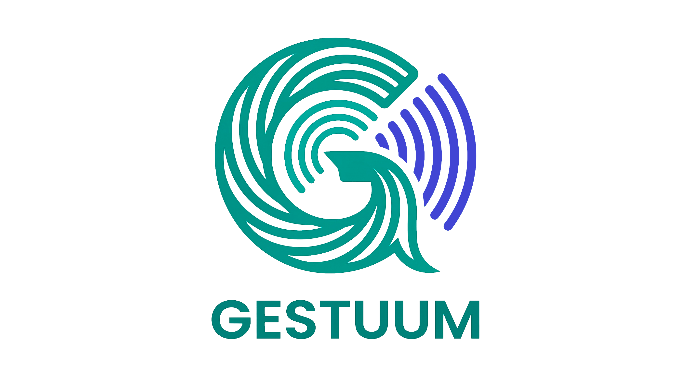

<div align="center">
  

  # GESTUUM — Sua voz não precisa de palavras.

  **Dispositivo vestível que transforma gestos em fala. Sem celular, sem internet.**
  Autonomia de comunicação para pessoas que se comunicam de forma diferente.

  [](LICENSE)
  []()
  [](https://www.coreeschool.org.br)

  **Site:** [gestuum.com](https://gestuum.com) · **Escola:** [COREE School](https://www.coreeschool.org.br) · **Programa IB**
</div>

---

## Índice

- [O que é](#o-que-é)
- [O projeto](#o-projeto)
- [Como funciona](#como-funciona)
- [Hardware](#hardware)
- [Funcionalidades](#funcionalidades)
- [Stack técnico](#stack-técnico)
- [Estrutura do repositório](#estrutura-do-repositório)
- [Build](#build)
- [Instalação sem compilar](#instalação-sem-compilar)
- [O que ficou pendente](#o-que-ficou-pendente)
- [Equipe e créditos](#equipe-e-créditos)
- [Por que código aberto](#por-que-código-aberto)
- [Licença](#licença)

---

## O que é

O GESTUUM é um sistema de tecnologia assistiva que reconhece gestos das mãos e os converte em fala em tempo real. Dois sensores vestíveis capturam o movimento, um motor de reconhecimento identifica o gesto e o áudio é reproduzido pelo alto-falante integrado ou por uma caixa de som Bluetooth.

Projetado para pessoas com dificuldade de fala — afasia, paralisia cerebral, ELA, autismo não-verbal, pós-AVC — o GESTUUM devolve autonomia de comunicação sem depender de telas, teclados ou conexão com internet.

> *"Comunicação é um direito, não um privilégio."*

## O projeto

O GESTUUM nasceu como projeto da **Feira de Ciências COREE 2026** (Programa IB), concebido, pesquisado e construído por estudantes da [COREE School](https://www.coreeschool.org.br).

A pergunta que moveu o projeto foi simples e humana: *como devolver autonomia de comunicação a alguém que não consegue falar?* A resposta foi um par de sensores que cabe na mão, lê o movimento e dá voz a quem se comunica de forma diferente — por menos de R$ 600, sem depender de telas nem de conexão.

Mais do que um trabalho de escola, foi uma pesquisa original — com pergunta, experimentos, dados e conclusão — e agora segue como **projeto-piloto de código aberto**, para que outras pessoas possam continuar de onde paramos.

## Como funciona

1. **Faça o gesto** — O sensor na mão capta aceleração e rotação a 50 Hz
2. **O GESTUUM entende** — O motor Orbital extrai a assinatura do movimento em <1 ms
3. **Sua voz é ouvida** — O áudio toca pelo speaker integrado e/ou Bluetooth

**Pipeline de reconhecimento:** `IMU (50 Hz) → Matrix3D (grid 11×11×11) → DTW → VoiceManager → áudio`

### Combine gestos para formar frases

A mão esquerda (Sensor A) define o **contexto** e a direita (Sensor B) define o **objeto**:

| Mão esquerda (contexto) | Mão direita (objeto) | Frase |
|---|---|---|
| Cozinha | Água | "Quero água" |
| Escola | Ajuda | "Preciso de ajuda" |
| Dor | Cabeça | "Estou com dor de cabeça" |

## Hardware

Dois sensores vestíveis:

| Dispositivo | Modelo | Função |
|---|---|---|
| Sensor Principal (A) | M5StickC Plus2 + HAT-SPK2 | IMU + display + áudio + reconhecimento de gestos |
| Sensor Secundário (B) | M5StickC Plus2 | IMU da mão auxiliar, transmite via ESP-NOW |

**Custo do kit completo:** ~R$ 600

## Funcionalidades

- **6 idiomas** — Português, English, Español, Français, 中文, العربية
- **4 perfis de voz** — Homem, Mulher, Menino, Menina
- **210+ frases por idioma** — Vocabulário expansível
- **53 gestos carregados** — Treináveis pelo usuário
- **Bluetooth A2DP** — Streaming para caixa de som externa
- **Configuração pelo navegador** — App BLE (notebook/PC) para treino e ajustes, sem instalar nada
- **100% sem fio** — ESP-NOW entre sensores (latência <5 ms)
- **Sem internet** — Tudo roda local no dispositivo

## Stack técnico

| Componente | Tecnologia |
|---|---|
| SoC | ESP32-PICO-V3-02 (dual-core 240 MHz, 8 MB Flash, 2 MB PSRAM) |
| Framework | Arduino via PlatformIO (espressif32@6.12.0) |
| Linguagem | C++ (firmware), Python (tools), HTML/CSS/JS (instalador/configurador) |
| Comunicação | ESP-NOW (canal 13), BLE GATT, Bluetooth A2DP |
| Áudio | I2S via M5.Speaker, WAV 48 kHz, SPIFFS 5.44 MB |
| Reconhecimento | Modelo Orbital (8 parâmetros) + Grid 11×11×11 + DTW |
| Site / PWA | HTML/CSS/JS estático, esp-web-tools, Cloudflare Pages |

## Estrutura do repositório

```
sensor_a/       Firmware principal (gestos + áudio + display)
sensor_b/       Firmware secundário (IMU via ESP-NOW)
shared/         Bibliotecas compartilhadas (protocol, constants, matrix3d, dtw)
app/            Instalador (gravar firmware via USB) + configurador (BLE)
tools/          Scripts Python (geração de áudio, backup SPIFFS)
Documentos/     Documentação técnica e datasheets de hardware
```

## Build

Requer [PlatformIO](https://platformio.org/) instalado.

```bash
# Listar as portas disponíveis (a porta varia conforme o dispositivo/máquina)
pio device list

# Compilar Sensor A
cd sensor_a && pio run

# Compilar Sensor B
cd sensor_b && pio run

# Upload firmware — o PlatformIO detecta a porta automaticamente.
# Se houver mais de um dispositivo conectado, informe a porta com --upload-port
cd sensor_a && pio run -t upload
cd sensor_b && pio run -t upload
# Exemplo com porta explícita (substitua pela sua):
#   pio run -t upload --upload-port COM6        (Windows)
#   pio run -t upload --upload-port /dev/ttyUSB0 (Linux/macOS)

# Upload áudios para SPIFFS (ATENÇÃO: apaga tudo no SPIFFS!)
cd sensor_a && pio run -t uploadfs
```

> A porta serial **não é fixa** — depende de qual dispositivo está conectado e em qual USB.
> Use `pio device list` para descobrir, ou deixe o PlatformIO detectar automaticamente quando só um dispositivo estiver plugado.

> **IMPORTANTE:** Sempre faça backup do SPIFFS antes de `uploadfs` — o comando apaga todos os arquivos (WAVs e JSONs de gestos).

## Instalação sem compilar

O firmware pré-compilado e o instalador web (esp-web-tools) ficam em `app/` — basta servir a pasta e gravar via cabo USB-C direto do navegador.

- **Recomendado e testado:** **Google Chrome no Windows** (notebook/PC)
- Edge e outros sistemas (macOS/Linux) que suportam Web Serial **devem** funcionar, mas **não foram testados**
- iPhone/iPad **não** funcionam (Safari não suporta Web Serial)
- Android é teoricamente possível (Chrome + adaptador OTG), mas **não foi testado**

## O que ficou pendente

O GESTUUM é um protótipo funcional, não um produto acabado. Próximos passos — e um convite para quem quiser continuar:

- **Reconhecimento v2 (DTW + Peak Direction):** distinguir gestos opostos e escalar com precisão para um vocabulário maior
- **Modo de contingência:** manter um conjunto essencial de palavras (sim/não/ajuda/socorro) funcionando mesmo se um dos sensores ficar sem bateria
- **Robustez e segurança:** reforçar a comunicação entre os sensores e a configuração via app
- **Voz do tutor:** permitir que um familiar grave a própria voz, para o usuário falar com a voz de quem cuida dele
- **Validação com usuários reais:** testes acompanhados por fonoaudiólogos e terapeutas ocupacionais
- **Mais vocabulário e idiomas:** expandir frases e perfis de voz

## Equipe e créditos

**Cientistas (estudantes · Programa IB):**

- Yasmin J.
- Maria Eduarda F.
- Francisco R.

**Orientação e tutoria:**

- **Prof. Andrey Queiroz Nascimento** — Geografia (G6 e G7). Licenciado em Geografia, especialista em Práticas do Ensino de Geografia e Educação Ambiental, com mais de 10 anos de experiência em educação e projetos sociais.
- **Carina Regina Lacava (Ms Lacava)** — CAS e Social Studies (G6, G7 e G8) e Language Arts (G7). Formada em Pedagogia e Psicologia, com especializações em psicopedagogia e educação inovadora; atua em salas bilíngues/internacionais desde 2009. Co-autora do livro *"Costurando Saberes"*.
- **Alexandre Jalkh** — Desenvolvimento técnico: firmware dos sensores (C++/ESP32), instalador e configurador web, e o pipeline de reconhecimento de gestos.

**Agradecimentos** à [COREE School](https://www.coreeschool.org.br) e à Feira de Ciências COREE 2026 por abrirem espaço para que jovens fizessem ciência de verdade — com impacto real na vida das pessoas.

## Por que código aberto

Tecnologia assistiva costuma ser cara e inacessível. Acreditamos que comunicação é um direito, não um privilégio — por isso liberamos **todo o código do GESTUUM** (firmware, instalador e configurador) sob a licença **PolyForm Noncommercial 1.0.0**.

Qualquer pessoa pode **estudar, montar o seu, modificar e compartilhar** o projeto para a própria comunidade — para uso **pessoal, educacional, de pesquisa e sem fins lucrativos**. A única restrição é que **não pode ser usado para fins comerciais**: acessibilidade não é produto. Se o GESTUUM ajudar uma única pessoa a ser ouvida, já terá valido a pena — e se você levar essa ideia adiante, valerá ainda mais.

## Licença

Código-fonte licenciado sob a **PolyForm Noncommercial License 1.0.0** — uso livre para fins **não-comerciais** (pessoal, educacional, pesquisa, sem fins lucrativos). **Uso comercial não é permitido.** Veja [LICENSE](LICENSE) e [NOTICE](NOTICE).

> Por usar uma licença não-comercial, o termo mais preciso é **"código aberto não-comercial" / source-available** — não "open source" no sentido estrito da OSI.

Copyright 2026 Alexandre Jalkh.

Projeto acadêmico — Science Fair COREE 2026, Programa IB.
